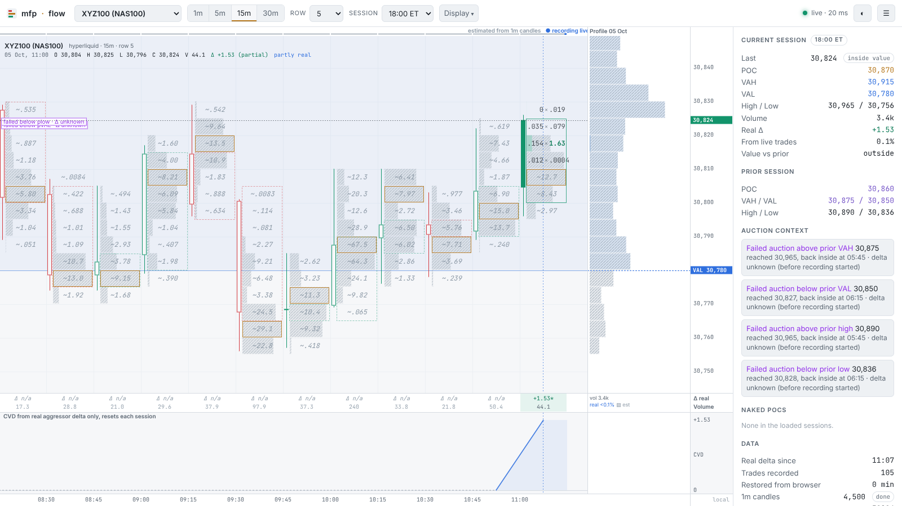

# mfp·flow

**Live footprint, session volume profile and real aggressor delta for every [MyFundedPerps](https://myfundedperpetuals.com) market**, built on MFP's public market-data stream. No API key, no backend, no account needed. Open the page and read the auction.


## What you get

- **Footprint.** Each bar shows aggressive sells (hit bid) × aggressive buys (lift ask) per price row, from MFP's `trades` stream with the aggressor side, plus diagonal imbalances, stacked imbalances, and the bar POC. Intervals are 1m / 5m / 15m / 30m, and the row size is selectable per market.
- **Session volume profile.** POC, a 70% value area (expanded two rows at a time from the POC), and a developing POC line. The session can be the UTC day (crypto) or a CME-style 18:00 ET day (indices, metals); DST is handled.
- **Prior-session context.** Prior POC, VAH, VAL, high and low, plus naked POCs from earlier sessions.
- **Delta.** Per-bar delta and session CVD from real aggressor flow only. Estimated delta is optional and labelled as such.
- **Auction context markers:** failed auctions vs prior value or extremes (including whether delta backed the break), poor highs and lows, single prints, low-volume nodes, and price-vs-CVD divergence. These describe structure. **They are context, not trade signals.**
- **Every MFP market,** including NAS100 (`xyz:XYZ100`), Gold, S&P 500, stocks and FX on Hyperliquid, and the full Binance perp list. Deep links work: `#XYZ100`, `#BTCUSDT`, `#hyperliquid|xyz:GOLD`.
- Dark and light themes, a local/UTC/New York clock, pan and zoom, a crosshair with per-cell breakdown, and a layout that works on mobile.



## Real vs estimated (read this)

The trade stream is **live-only**. That shapes what you see:

| Data | Source | Shown as |
| - | - | - |
| Bars since you opened the page | recorded trades with the aggressor side | solid cells, real delta |
| Older bars, ~3 days back | 1-minute candles, volume spread evenly over each candle's range | hatched cells, `~` values, delta "n/a" |

Recorded trades are kept in your browser (IndexedDB), so reopening the page keeps your real-delta history. The live recorder reconciles exactly with the venue's 1m candle volume (see `npm run smoke`). Value areas built mostly from candle history are approximations of the true profile.

## Run it

```bash
npm install
npm run dev        # http://localhost:5173
npm test           # 53 unit tests (value area, bucketing, footprint, sessions, auction context)
npm run smoke      # 20 s against the live stream: trade counts, dedupe, trade-vs-candle reconciliation, POC/VA
npm run build      # static site in dist/, deployable to any static host (relative paths)
npm run markets    # refresh the bundled market list
```

## How it uses MFP

- `wss://api-stream.myfundedperpetuals.com/v1/market-data`. One multiplexed connection carries `trades`, `marketStats` (mark, OI, funding) and live `candles`. It also uses `candles.history` paging for backfill, reconnects with backoff and jitter, resubscribes, replaces itself on `draining`, and backfills gaps after reconnects.
- `GET /v1/markets` for the market list. Its CORS policy only allows MFP's docs origin, so the app ships a snapshot (`npm run markets`) and uses the live list when the browser can read it.

## Not affiliated with MyFundedPerps

Analysis tool only. Nothing here is a signal or a recommendation, and nothing here claims an edge.
