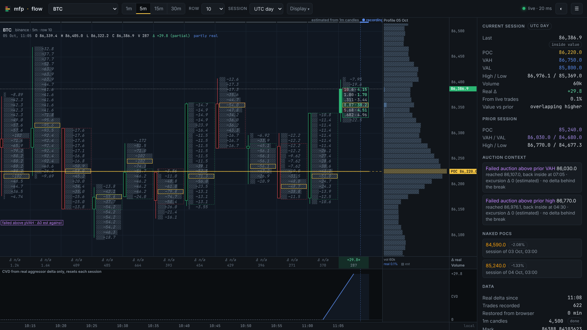
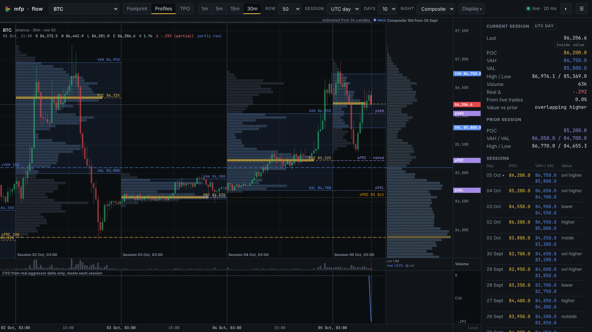
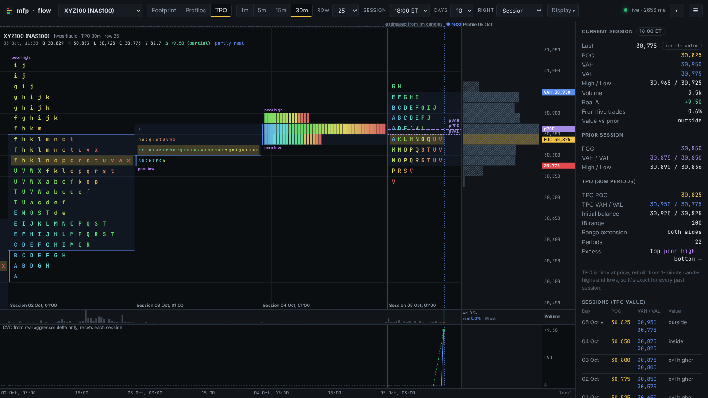
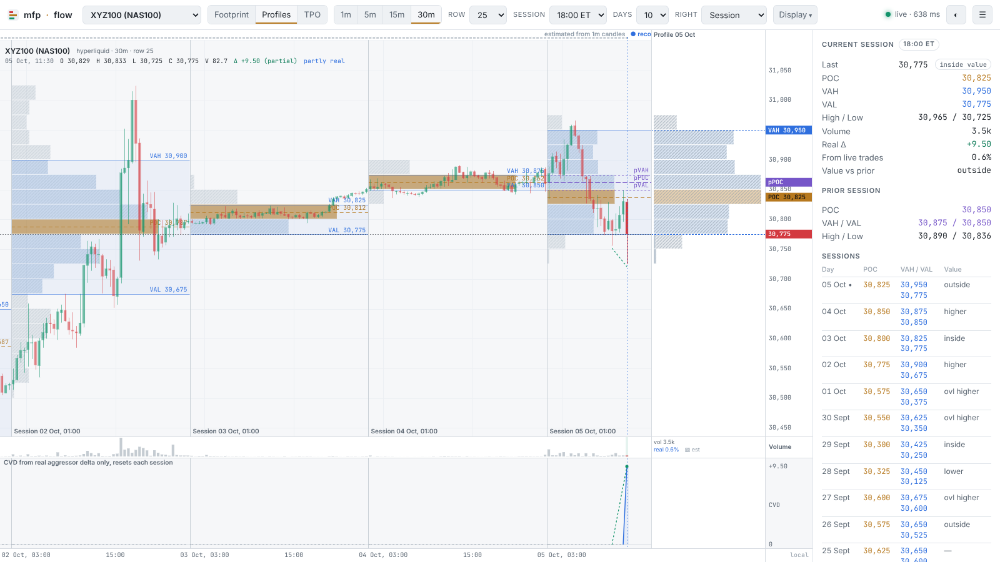

# mfp·flow

**Live footprint, session volume profile and real aggressor delta for every [MyFundedPerps](https://myfundedperpetuals.com) market**, built on MFP's public market-data stream. No API key, no backend, no account needed. Open the page and read the auction.



## Three views

| Footprint | Profiles | TPO |
| - | - | - |
| Bid × ask per price row with real aggressor delta | Each day's volume profile inside its own time span, plus a composite | Market Profile letters per 30m period, exact from candle highs and lows |





## What you get

- **Footprint.** Each bar shows aggressive sells (hit bid) × aggressive buys (lift ask) per price row, from MFP's `trades` stream with the aggressor side, plus diagonal imbalances, stacked imbalances, and the bar POC. Intervals are 1m / 5m / 15m / 30m, and the row size is selectable per market.
- **Session volume profile.** POC, a 70% value area (expanded two rows at a time from the POC), and a developing POC line. The session can be the UTC day (crypto) or a CME-style 18:00 ET day (indices, metals); DST is handled.
- **Prior-session context.** Prior POC, VAH, VAL, high and low, plus naked POCs from earlier sessions.
- **Previous days (Profiles view).** Every session's volume profile is drawn in its own time span with VA shading and POC/VAH/VAL labels. History depth is 3, 5 or 10 days.
- **Composite profile.** The right-hand profile can merge the last N days, and the composite VAH/VAL/POC lines are drawn across the chart.
- **TPO (Market Profile).** 30-minute letters A–X then a–x, TPO POC and value area, an initial-balance bracket, range extension, single prints, tails (excess) and poor highs/lows. TPO is time at price, so it is **exact** for every past session; it doesn't depend on recorded trades.
- **Sessions table.** POC, VAH/VAL and value migration (higher / lower / overlapping / inside / outside) for every loaded day.
- **Delta.** Per-bar delta and session CVD from real aggressor flow only. Estimated delta is optional and labelled as such.
- **Auction context markers:** failed auctions vs prior value or extremes (including whether delta backed the break), poor highs and lows, single prints, low-volume nodes, and price-vs-CVD divergence. These describe structure. **They are context, not trade signals.**
- **Every MFP market,** including NAS100 (`xyz:XYZ100`), Gold, S&P 500, stocks and FX on Hyperliquid, and the full Binance perp list. Deep links work: `#XYZ100`, `#BTCUSDT`, `#hyperliquid|xyz:GOLD`.
- Dark and light themes, a local/UTC/New York clock, pan and zoom, a crosshair with per-cell breakdown, and a layout that works on mobile.



## Real vs estimated (read this)

The trade stream is **live-only**. That shapes what you see:

| Data | Source | Shown as |
| - | - | - |
| Bars since you opened the page | recorded trades with the aggressor side | solid cells, real delta |
| Older bars, ~3 days back | 1-minute candles, volume spread evenly over each candle's range | hatched cells, `~` values, delta "n/a" |

Hyperliquid keeps only about 5,000 one-minute candles (~3.5 days), so for HL markets (NAS100, Gold, S&P 500…) older sessions are filled from **30-minute candles**. That's exact for TPO and 30m bars, and an approximation for volume profiles; the panel shows where the switch happens.

Recorded trades are kept in your browser (IndexedDB), so reopening the page keeps your real-delta history. The live recorder reconciles exactly with the venue's 1m candle volume (see `npm run smoke`). Value areas built mostly from candle history are approximations of the true profile.

## Run it

```bash
npm install
npm run dev        # http://localhost:5173
npm test           # unit tests (value area, TPO, composite, bucketing, footprint, sessions, auction context, links, MCP shaping)
npm run smoke      # 20 s against the live stream: trade counts, dedupe, trade-vs-candle reconciliation, POC/VA
npm run build      # static site in dist/, deployable to any static host (relative paths)
npm run markets    # refresh the bundled market list
npm run mcp:smoke  # build the MCP server and exercise every tool against live data
```

## Ask it questions: the MCP server

The same analytics are exposed over [MCP](https://modelcontextprotocol.io), so Claude Code, Claude Desktop or any MCP client can ask about auction structure on any MFP market. It needs no API key and it is **read-only** — nothing in this project places, modifies or cancels an order.

```bash
npm install && npm run mcp:build
claude mcp add mfp-flow -- node "$PWD/dist-mcp/mfp-flow-mcp.js"
```

Once published to npm this becomes `claude mcp add mfp-flow -- npx -y mfp-flow-mcp`. Then `/mcp` lists the server and four tools:

| Tool | Answers |
| - | - |
| `list_markets(query?)` | which markets exist, with aliases like NAS100 |
| `get_session_profiles(market, days, row?, session?)` | per-session POC, value area, high/low, volume, real share, value migration |
| `get_tpo(market, days, row?, session?)` | TPO POC and value area, initial balance, range extension, single prints, tails, poor highs/lows |
| `get_levels(market, days, session?)` | last price, location vs value, prior levels, naked POCs with distance, composite value, failed auctions |

Try:

- *"Where are NAS100's naked POCs and is value migrating higher this week?"*
- *"Did BTC's initial balance extend today, and did it leave a poor high?"*
- *"Compare where gold is trading against its last five days of value areas."*

Every response carries a `data_quality` block saying what is exact and what is inferred: TPO is exact for any past session, volume is exact but its buy/sell split is only real for the share recorded live, and aggressor delta exists only from the moment the server started. Prices come back as decimal strings at the market's tick, and a short `summary` line is included so an agent can quote one sentence without re-deriving anything. The numbers match the web app for the same settings.

## How it uses MFP

- `wss://api-stream.myfundedperpetuals.com/v1/market-data`. One multiplexed connection carries `trades`, `marketStats` (mark, OI, funding) and live `candles`. It also uses `candles.history` paging for backfill, reconnects with backoff and jitter, resubscribes, replaces itself on `draining`, and backfills gaps after reconnects.
- `GET /v1/markets` for the market list. Its CORS policy only allows MFP's docs origin, so the app ships a snapshot (`npm run markets`) and uses the live list when the browser can read it.

## Not affiliated with MyFundedPerps

Analysis tool only. Nothing here is a signal or a recommendation, and nothing here claims an edge.
